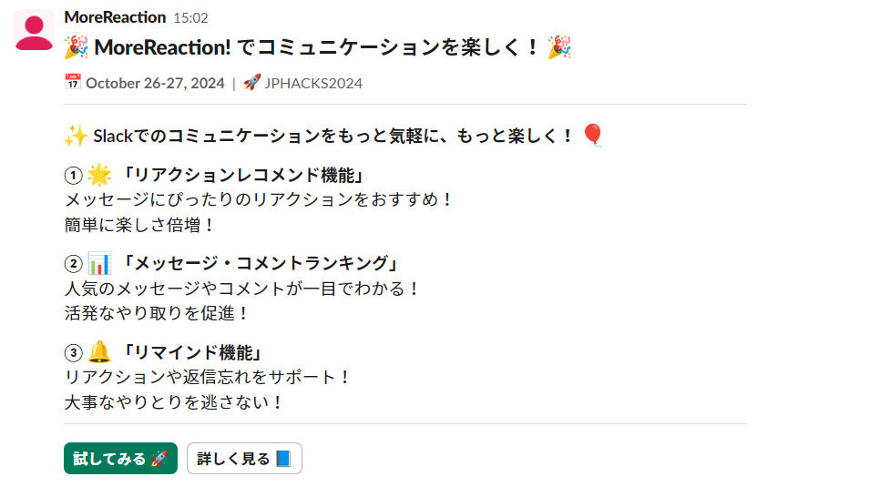

# MoreReaction!

## 製品概要

**Slackでのコミュニケーションをもっと気軽に、もっと楽しく！**

### 背景(製品開発のきっかけ、課題等)

#### きっかけ

私たちは同じ課外活動に参加し、サービスを運用する活動を行っています。活動を進めるには密なコミュニケーションが必須で、特に活動日以外でのコミュニケーションにおいてSlackは重要な役割を果たしています。しかし、返信やリアクションが遅い人も多く、話を素早く進められないことを課題に感じていました。そこでこの"MoreReaction"を使うことで、もっと気軽に、もっと楽しくコミュニケーションができるようにしたいと考えました。

#### 課題の原因考察

* リアクションやメッセージ送信をすることにプレッシャーを感じる
* メッセージに対して、どのリアクションが適しているかわからない
* 1年生は特に、使用経験がないSlackというツールを初めて触るため、慣れていない
* メッセージを読むだけで済ませ、リアクションや返信を忘れる

<!-- #### 現在のチャットツールの課題

* コメント・リアクションに対する心理的ハードルが高い
* (メンションを宛てていて)連絡・リアクションが欲しいメッセージに対して何も反応がない
* 活気が無く、必要な情報交換などが行われない -->

### 製品説明（具体的な製品の説明）

<!-- 意思決定の高速化とSlack文化への慣れの援助を期待し、次の機能を実装しました。 -->

### 特長

#### 特長1「リアクションレコメンド機能」により、メッセージに対応するリアクションのレコメンドを動的に表示！

* メッセージの特徴とリアクションの傾向をベクトル化し、コサイン類似度を計算
* 様々な利用者のSlack文化に合わせてリアクションをレコメンド

#### 特長2「メッセージ・コメントランキング」により、メッセージやリアクションを活発化！

* メッセージ投稿回数、リアクション回数、リアクション速度の3項目で評価し、月末に結果発表
* ランキング上位には、DMで祝福メッセージが投稿

#### 特長3「リマインド機能」により、リアクションや返信忘れを防止！

* メンションにリアクションがなかった場合、リマインドメッセージを3段階で投稿

### 解決出来ること

* リアクションレコメンド機能により、リアクションへの心理的ハードルを軽減
* ポイントランキング機能により、コミュニケーションを活発化
* リマインド機能により、返信信頼度を高める

* 意思決定速度の高速化
* 1年生がSlack文化への慣れを援助する

### 今後の展望

* Slack以外のDiscordやTeamsへのマルチプラットフォーム対応

### 注力したこと（こだわり等）

* 無料プラン内での運用
* マルチプラットフォームを見据えた設計
* 利便性重視の実運用
* レコメンドの柔軟性

## 開発技術

* 設計について
  * [figjam](https://www.figma.com/board/uGAQhNI7xu9e9lT2fUmi2d/%E3%83%AA%E3%82%A2%E3%82%AF%E3%82%B7%E3%83%A7%E3%83%B3%E3%83%BB%E3%82%B3%E3%83%A1%E3%83%B3%E3%83%88%E3%83%A9%E3%83%B3%E3%82%AD%E3%83%B3%E3%82%B0%E6%A9%9F%E8%83%BD?node-id=36-1047&node-type=table&t=27j6yjInJIur9F7o-0)

### 活用した技術

#### API・データ

* SlackAPI
* SlackBot
* Deno
* Render
* Cloudflare
* Supabase EdgeFunction
* Supabase Database
* Vectorize

#### フレームワーク・ライブラリ・モジュール

* TypeScript

#### デバイス

* Web, Mobile, Desktop(Slackが入るデバイス全般)

### 独自技術

#### ハッカソンで開発した独自機能・技術

*